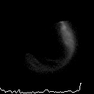
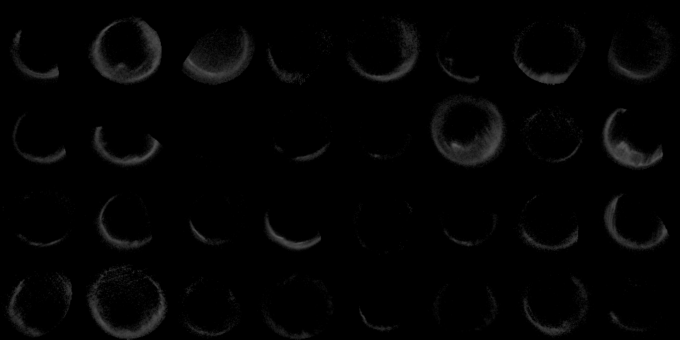
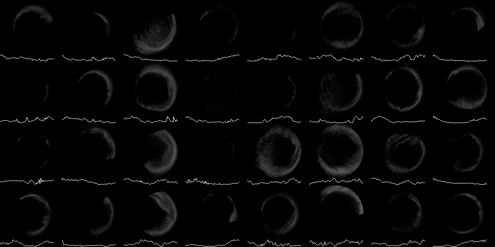
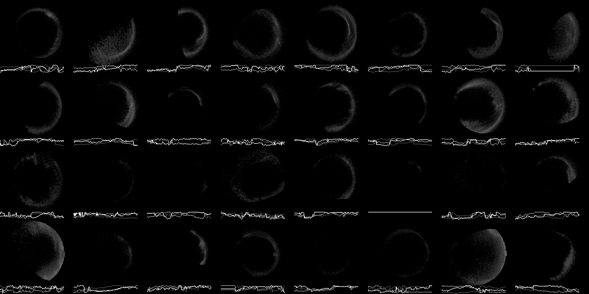
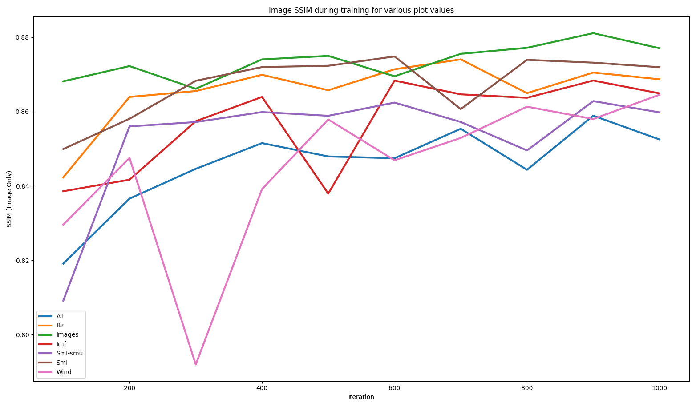

# AuroraLearner
Code to preprocess auroral images from the Polar spacecraft and magnetic index data, and a modified [MotionRNN](https://arxiv.org/abs/2103.02243) framework to train and test on these images. Partial code is also given to process images taken from the IMAGE spacecraft.

An example of a preprocessed image with a line graph of the SMU index is shown below:

## Results
Batches of 32 different image sequences are shown below. The first three frames in this animation are the real frames from the dataset, and the next four are frames predicted by MotionRNN.

Prediction with auroral images only:

Prediction with the SML index:

Prediction with Interplanetary Magnetic Field readings:

The SSIM of the auroral image was evaluated at regular intervals during training. Many different permutations of geomagnetic indices and solar wind parameters were used.

## Installation and Use
- Python 3.11.2 was used to develop this software, but Python 3.10 may also work.
- PyTorch 2.6.0 should be installed for the correct device.
- Install other requirements using `pip install -r requirements.txt`
- Download Polar dataset images. This project uses the dataset provided by Jiang et al. and can be downloaded from SciDb [here](https://www.scidb.cn/en/detail?dataSetId=6e62c6f43fbc440092441c4e56286dee). This dataset must be placed in the directory `./polar/images_raw`.
- Download geomagnetic indices and solar wind parameter data from [SuperMAG](https://supermag.jhuapl.edu/indices/). The software expects this data as several CSV files placed in `./polar/indices`.
- Generate the datasets to be trained by running the following commands:
    - `python ./polar/process.py indices`
    - `python ./polar/process.py images gs`
    - `python ./polar/process.py combine`
- Train the models by running `./polar-train.ps1` in PowerShell. This file can be modified to tweak various parameters or to change which models get trained.
- Once trained these models are saved in `./checkpoints`. Tests are performed during training but additional tests can be performed by running `./polar-test.ps1`.
- Results are recorded using TensorBoard. This can be started with `tensorboard --logdir runs` and going to the URL that the command provides.